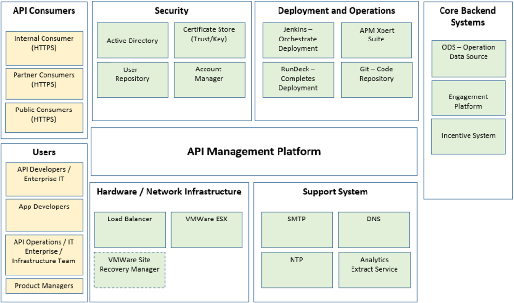
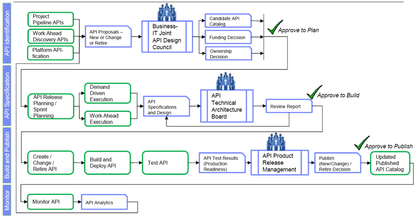
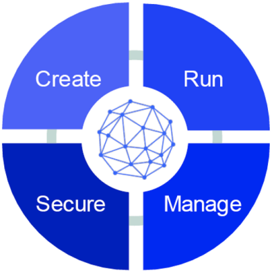

# API Lifecycle and Governance in the Enterprise: Plan Stage (Part 1 of 3)
As the saying goes, "**Bad governance is like bad design it makes life harder**"; with that in mind, we are opting for a design-first approach. Thus,  choosing the right API strategy is directly related to the ability to attract the right **people**, with the correct **process** in place and by deploying the right **technology** to align with the company's strategy.

  
**Figure 1: Balancing act between people, process and technology**

API (Application Programming Interface) Lifecycle and Governance has the scope of an API Management platform architecture overview or a high-level design. The architecture team built it with input from the product subject matter experts (SMEs) or domain experts and IT specialists for technical accuracy and product specifics. The purpose of the API Lifecycle and Governance is to:

- Increase the understanding of the intended API Management platform by reducing the complexity of its interactions to a set of fundamental ones.
- Ensure that architectural issues, such as topology and integration between the components, are dealt with consistently across the environments, and common problems have a single solution that every environment can (re)use.
- Communicate the chosen architecture to all participants/stakeholders. 
- Avoid repetitive documentation of generic structures and interactions.
- Provide the architecture framework within which the engineers to make design/implementation decisions that do not conflict with the architecture.

Governance is intended as a template for the IT specialists to follow in building the API Management environments. The focus of this blog post is on the IBM API Connect Governance and Lifecycle and NOT the entire architecture associated with the wider solution. As mentioned above, the API Management platform is wider than any mobile application; however, the immediate focus is to assure the successful launch of the API application. Therefore, the focus of this blog post will be on supporting the Runtime governance and Design time governance.
Runtime governance (for API’s that are already deployed)
- Access control (only subscribed clients)
- Control who can see published API products
- Control who can subscribe to API products – and subscription approval
- Rate limiting, capacity planning and invoicing
- Life cycle management and approvals
- Make sure API consumers migrate to the latest version in a timely manner
- Suspending API consumers
- Off-lining APIs
- Global runtime policies (executed for all APIs of the catalog)

Design time governance
- API providers should not provide an API already in existence
- API consumers find existing APIs
- Endpoint vs. environment
- Impact analysis
- Versioning

## Planning an API Initiative Strategy and Governance Model
APIs should be intended primarily for consumption by front-end systems, either directly or indirectly, as those are the ones for which an API layer will have the most benefit, providing for controlling the consumption of APIs. Other back-ends can consume APIs from a technical perspective, but that is not their primary benefit or role.

This has several benefits:

- Currently separated but similar APIs can be merged and supported centrally where it makes sense to do so.
- API discovery can be performed, where internal (and ultimately external) innovation projects can discover new APIs.
- Developing APIs before them being requested by specific projects may reduce delivery time for projects needing to use them.

"Loops" in API provision, where one API is ultimately used to form another, should be kept to an absolute minimum. While there may be some exceptional cases, this can make the management of the APIs significantly more complex as we introduce dependencies on the lifecycle of one API and how it affects another. In this case, it may make sense to start introducing separate API Connect installations or at least catalogs to keep these partitioned.

Long-term, APIs may be exposed externally to some companies, to third parties and business partners outside the firewall. It's not something that is under consideration in the medium-term future for some companies. We'll address this possibility only lightly in this blog posts.

### Why API Governance?
In the general case, API Governance exists to provide control over API design, development, deployment, and management going forward. This is partly to bring technical benefit (and hence reduced costs at all phases of the API lifecycle), but also to provide greater benefit to the business in the use of API Connect. Specifically, we are aiming to:
- Highlight areas for improvement in the current approach to API development and management.
- Ensure alignment across companies, and its partners on development, testing, production deployment,  and maintenance of API Connect.
- Improve the quality, speed of development, and consistency of APIs going forward.
- Provide standards and guidelines companies and its partners (e.g., IBM) to adhere to.

Once signed off, all API design, implementation, and management should adhere to the guidelines going forward. Any deviations should be agreed and documented with the company's Technical Platform Owner for IBM API Connect.

This blog post is focused more on governance and lifecycle and architecture; for other topics that deal with project management processes to make sure that APIs are built and rolled out appropriately could be elaborated on a separate blog post.

## Design Context
The Design Context elaborated in this section describes the high-level context in which the decisions of the Governance were made.
Describing the context means describing the circumstances that form the setting for the Governance design, and in terms of which the Lifecycle can be fully understood and assessed. Thus, context is described in terms of the highest-level goals and objectives that apply to the API Management platform as it is being designed, as well as the constraints and considerations that apply.

### API Management Context
The system context diagram shows the setting that the API Management platform will be deployed into. The diagram shown below is separated into several key areas:
- **API Consumers**: these are entities that will consume APIs that are exposed to the platform.
- **Users**: various groups of users will interact with the platform, such as App Developers to subscribe to APIs and API Developers to define the exposure of APIs.
- **Security**: system capabilities that are required to secure the platform.
- **Deployment and Operations**: systems that support the monitoring and deployment activities for the platform.
- **Hardware / Network Infrastructure**: the core infrastructure that the platform will be built on.
- **Support System**: this corresponds to the peripheral systems that the platform will interact with, such as, NTP and DNS.
- **Core Backend System**: these are entities that will provide the underlying Services that are exposed on the platform.

**Figure 2:  System Context Diagram**

### Key Objectives and Infrastructure Principles
Companies may want to create a new API Management platform suitable for exposing and managing APIs to internal, partner, and public consumers. The focus for phase I will be to support the release of the mobile application, and therefore the focus of this blog. The key objectives of this platform are as follows:
- **Security**: provide the capability to identify and authorize users of APIs. This may include traditional user credentials and token-based solutions (such as OAuth 2).
- **Traffic Analytics**: provide insight into the API usage patterns across channels, devices, and partners. This information will be provided to the users. 
- **Management & Throttling of APIs**: the ability to control the access granted based on the subscribed plans.
- **API Lifecycle management**: the ability to control, using a lightweight governance model, the API exposure lifecycle.
- **Discovery & Subscribe to APIs**: allow API consumers the ability to discover and subscribe to APIs within a catalog.
- **Continuous Availability**: the platform must provide high availability in normal operations and be available during maintenance windows.
- **Agility**: the platform must support the requirements to create solutions in an agile methodology while providing adequate governance.

Companies with several Infrastructure principles may need to be considered during the platform design. If the design of the platform deviates from these principles, then this should be documented within the environment section.
- High Availability is defined as, no single instance of a software component should be able to fail and cause the platform to become unavailable. For instance, each logical component must have redundancy.
- Within the Production environment, high availability should be provided within the Data Center.
- Products should be created with an Active / Active topology to support the continuous availability objective.
- Dedicated (or pinned) resources should be associated with any virtualized Production environments to assure a consistent performance profile. 
- Not all Non-Production environments need to be highly available; however, the Cert environment should be, to provide an opportunity for High Availability testing. 
- All Production hosted components for the solution should be located within the same Data Center and visible across sites.
- The Production environment should NOT share hardware with Non-Production environments.
- The Cert Non-Production environment includes information and therefore has similar security considerations to the Production environment.

## Roles within API Connect
The existing API Connect describes a **RACI** (Responsible, Accountable, Consulted, Informed) matrix for both incident management on the API Connect platform to an application and platform management. A responsibility assignment matrix, also known as RACI matrix, describes the participation by various roles in completing tasks or deliverables for a project or business process. It is especially useful in clarifying roles and responsibilities in cross-functional/departmental projects and processes.

| Role              | Description                                                  |
| ----------------- | ------------------------------------------------------------ |
| (R) Responsible   | Those who do the work to achieve   the task. There is at least one role with a participation type of   responsible, although others can be delegated to assist in the work required. |
| (A) Accountable   | The one ultimately answerable for   the correct and thorough completion of the deliverable or task, and the one   who delegates the work to those responsible. In other words, an accountable   must sign off (approve) work that responsible provides. **There must be only one accountable specified for each task or deliverable.** |
| (C) Consulted     | Those whose opinions are sought,   typically subject matter experts; and with whom there is two-way   communication. |
| (I) Informed      | Those who are kept up-to-date on   progress, often only on completion of the task or deliverable; and with whom   there is just one-way communication. |

A summary of the role names relevant to this document is here for a more comprehensive list:

| Name                                                         | Role                                                         |
| ------------------------------------------------------------ | ------------------------------------------------------------ |
| IT   Project Manager / Enterprise Project Manager            | A PM responsible specifically for   a project which may use / create APIs in API Connect |
| IT   Technical Architect / IT Technical Lead / IT API Technical Lead | An architect responsible for the   overall technical infrastructure of a project which may use / create APIs in   API Connect (exact titles and roles may vary project-to-project). |
| Technical   Architecture Board                               | A person / board responsible for   overseeing technically how APIs are used / implemented. This   would include owning APIs shared between multiple projects, including   deployment, definition, and testing. |
| Design   Council                                             | A person / board responsible for   overseeing which APIs are pro-actively / prospectively created. |
| API   Developer                                              | A developer responsible for   implementing APIs              |
| App   Developer                                              | A developer responsible for   developing apps which consume APIs |
| Infrastructure   council                                     | Expertise and skills required to   support the infra, can propose architecture to support the recommended   environment. |

Roles indicated above may not yet exist in the organization, but we are recommending their creation as and when the company transitions to an API Economy (internally shared and common APIs derived from business function rather than technical need).

## API Lifecycle
This section describes the lifecycle that we recommend an API undertake through API Connect. Currently, the lifecycle that an API can take in API Connect is not fully exploited – versions of APIs are not kept distinct, APIs are not retired/deprecated, etc. IBM recommends that for clarity and ease of management as API portfolio grows that these APIs are managed according to a process like this one (this process should be owned by the Technical Architecture Board as amended over time as necessary).

**Figure 3:  API Lifecycle Flow**

The API lifecycle consists of four main components related to API management which includes **creating**, **running**, **managing**, and **securing** APIs for a range of applications in a digital ecosystem. Each one of these components is critical to the successful development, deployment, and ongoing management of APIs. The API lifecycle provides the foundation of an API strategy.

Figure 4: Create. Run. Manage. Secure.

An integrated solution that includes:
- Automated, visual, and coding options for creating APIs
- Automated discovery of system of records APIs
- Node.js and Java support for creating API implementations
- Integrated enterprise grade clustering, management, and security for Node.js and Java
- Lifecycle and governance for APIs, Products, and Plans
- Advanced API usage analytics
- Customizable, self-service developer portal for publishing APIs
- Policy enforcement, security, and control

### Enterprise focused
**Comprehensive API solution** End-to-end integrated experience across API lifecycle – create, run, manage, secure, socialize, and analyze APIs through single offering on-premises, in the cloud or hybrid.

**Built-in assembly user experience and policies** Use a visual tool to compose API policy flows and built-in policies to secure, control, and optimize API traffic without writing custom code or logging on to the gateway

**Intuitive interface** Modern user experience to reduce complexity, improve performance, and allow quicker creation, management, and enforcement of APIs.

### Developer focused
**Create and run APIs** Rapidly create APIs, connect to data sources, and expose them as REST APIs with a model-driven approach. Run Node.js and Java runtimes with unified operations and management. APIs can also be SOAP web services.

**First class developer experience** Enable developers to create and test APIs locally on their workstations in minutes and stage it to on-premises or cloud environments.

**Developer toolkit** Enable automated scripting and DevOps automation through a command-line environment for defining, managing, and deploying APIs.

## Conclusion
In part one of three of this blog on API Lifecycle and Governance in the Enterprise, we discussed the importance of having a good **Governance** with **"Planning an API Initiative Strategy and Governance Model"** in mind. For part two we will discuss on a comprehensive API Solution, with end-to-end integrated experience across API lifecycle - create, run, manage, secure, socialize & analyze APIs through a single offering on-premise, in the cloud or hybrid. From this point forward, we will set the stage to introduce the API Design Guidelines.

Thoughts and ideas are much appreciated! And if you would like to learn more about how you can co-create with the [**IBM Garage**](https://www.ibm.com/services/garage),  please check out our website https://www.ibm.com/services/garage to book a visit with our team.

## References
* [Create, Manage, Secure: Take control of your API lifecycle with IBM API Connect](https://developer.ibm.com/apiconnect/)
* [How Do You Ensure API Quality?](https://medium.com/apitest/how-do-you-ensure-api-quality-e1f46a1bd49e)
* [Sample API Use Cases for Insurance](https://medium.com/open-insurance/sample-api-use-cases-for-insurance-2e615af54775)
* [Future-proof your API lifecycle strategy](https://medium.com/@SnapLogic/future-proof-your-api-lifecycle-strategy-2e5507578349)
* [API GOVERNANCE IN THE ENTERPRISE](https://medium.com/@robert.broeckelmann/api-governance-in-the-enterprise-e6651a3b75db)

